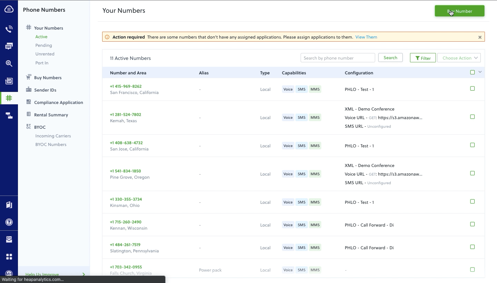
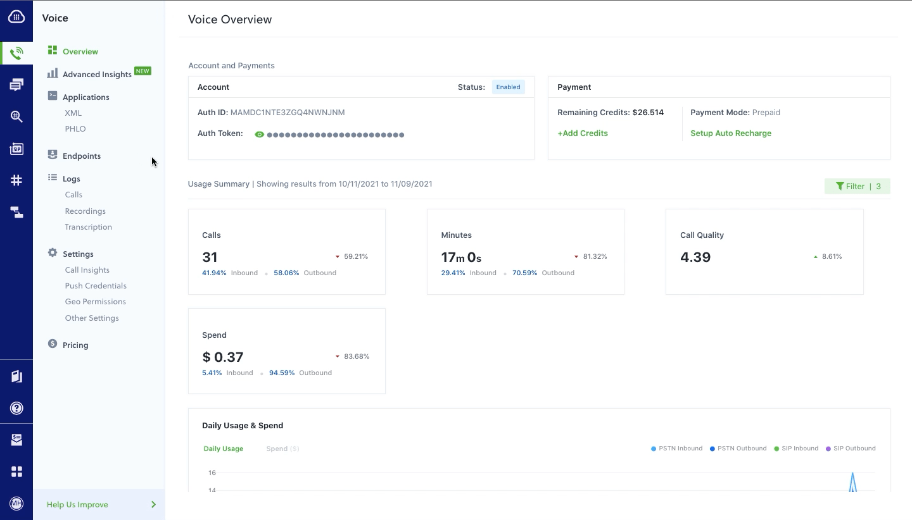

[](https://opensource.org/licenses/MIT)

# Plivo webRTC phone
Simple softphone made with Plivo's webRTC browser SDK. Calls can be made to PSTN numbers and SIP addresses.

Two ways to make a call

* Call via the browser (uses <a href="http://opus-codec.org/" target="_blank">OPUS Codec</a>)
* Click-to-call
     User enters their phone number in the settings. When a call is placed, the user's handset will be called first and then the call will be connected to the destination #


## Application setup

Some initial setup is required before using this application (< 10 minutes). Let's get started!

1. Register for a Plivo account here <a href="https://console.plivo.com/accounts/register/">https://console.plivo.com/accounts/register/</a>

2. Purchase a new Plivo phone number from your [Plivo console](https://console.plivo.com/active-phone-numbers/).
  

3. Create a `PHLO`. This will handle all of the call logic behind the scenes once a call is initiated for click to call and assign it to the number purchased in *step 2*.

    

    Every PHLO begins with a _start node_ that can be triggered by an HTTP request or an incoming call (incoming SMS if it is an SMS PHLO). Since our phone can make calls in more than one way, we'll utilize both trigger events here. 

    Let's start with an incoming call. 

    When the phone is configured to make calls from the browser, all we have to do is use the browser SDK's call() method to initiate a call from our application endpoint to our destination #. In this case our PHLO is the endpoint, so our outbound call is actually treated as an _inbound_ call to our PHLO. Once we hit the endpoint we just forward the call to our destination number.

    our code should look like this:
    ```
      const customCallerId = <caller_id>;
      const extraHeaders = {'X-PH-Test1': 'test1', 'X-PH-callerId': customCallerId};
      this.plivoBrowserSdk.client.call(dest, extraHeaders);
    ```

    Now for the click-to-call. This is is a slightly more complicated use case because it requires us to actually send an HTTP request with a payload to our PHLO endpoint. Remember that we will be making a call to our user's handset first, and then connecting to the destination once the first call is answered. We'll need to get both phone numbers from our application and send it to our server. Our code should look something like this:

    ```
    let XMLReq = new XMLHttpRequest();
    XMLReq.open("POST", "/makeCall");
    XMLReq.setRequestHeader("Content-Type", "application/json");
    XMLReq.onreadystatechange = function() {
        console.log('response text', XMLReq.responseText);
    }
    XMLReq.send(JSON.stringify({"src": this.state.phoneMeNumber, "dst": dest}));
    ```

    We'll need to listen for this request on our server. Once we receive this request and get the numbers from the payload, we will set up another HTTP request that sends this data to our PHLO. Here's our code: 

    ```
    // when we receive an http post request
    app.post('/makeCall/', function(req, res) {
      console.log(req.fields);

      jsonObject = JSON.stringify({
          "phoneMeNumber"     : req.fields.src,
          "destinationNumber" : req.fields.dst,
      });

      // prepare the header
      let postHeaders = {
        'Content-Type' : 'application/json',
        'Authorization': 'Basic ' + new Buffer.from(process.env.PLIVO_AUTH_ID + ':' + process.env.PLIVO_AUTH_TOKEN).toString('base64')
      };

      // set the post options
      let postOptions = {
        port   : 443,
        host   : 'phlo-runner-service.plivo.com',
        path   : process.env.PHLO_ID,
        method : 'POST',
        headers: postHeaders,
      };

      // do the POST request
      let reqPost = https.request(postOptions, function(response) {
        console.log("statusCode: ", response.statusCode);
        response.on('data', function(d) {
          console.info('POST result:\n');
          process.stdout.write(d);
          console.info('\n\nPOST completed');
          res.send(d);
        });
      });

      // write the json data
      console.log(jsonObject);
      reqPost.write(jsonObject);
      reqPost.end();
      reqPost.on('error', function(e) {  // log any errors
        console.error(e);
      });
    })
    ```

4. Create a new [Plivo endpoint](https://console.plivo.com/voice/endpoints/) and assign it to the application created in Step 3. (_Note: your endpoint username and password will be used for signing in_)

  


## Deploying the application
```
git clone https://github.com/plivo/webRTC-phone.git

cd webRTC-phone
```

### Setting up your app

* open `.env` folder and replace the place holders `<auth_id>`,`<auth_token>` & `<phlo_url>` with the values available in your [Plivo dasboard](https://console.plivo.com/dashboard/) & [Plivo PHLO Console](https://console.plivo.com/phlo/list/) respectively.

```
PLIVO_AUTH_ID="<auth_id>"
PLIVO_AUTH_TOKEN="<auth_token>"
PHLO_ID="<phlo_url(https://console.plivo.com/phlo/list/)>"
```

* update the callerId under `client/src/components/phpne_pad.jsx`, replace the place holder `<caller_id>` with the Plivo phone number purchased.
```
const customCallerId = "<caller_id>";
```

## Execute the below commands to run your app
```
npm install

npm run watch

npm run start
```
## Features

* Make calls (Browser, Click-to-call)
* Receive calls
* Log calls
* Live call quality metrics (displayed in real time during network events during the call)
* Send feedback to Plivo

## Built With

* [React](https://reactjs.org/) - Javascript framework for building UIs
* [Material-UI](https://material-ui.com/) - React components that implement Google's material design standards
* [Plivo](https://www.plivo.com/) - Making and receiving calls
## License

This project is licensed under the MIT License - see the [LICENSE.txt](LICENSE.txt) file for details


